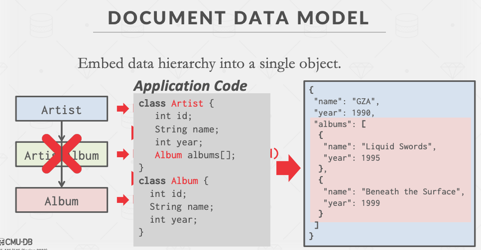

# 01-Introduction

## 1. Database 

一些相互关联的数据进行有组织的集合，这些数据是对现实世界的某些方面建模。

&#x20;数据库是大多数计算机应用的核心组成部分。


数据库(DB) != 数据管理系统(DBMS)。

Database management system是一种管理数据库的软件。


数据库的例子。创建一个数据库来模拟电子音乐商店来跟踪艺术家和专辑，可能需要的东西。&#x20;

* 关于 Artists 的信息
* 这些 Artists 发行了哪些 Albums

## 2. Flat File Strawman 

将我们的数据库存储为逗号分隔的值（CSV）文件，我们在应用程序代码中自己管理这个文件。

* 每个实体使用一个单独的文件
* 应用程序必须在每次要读取/更新记录时解析这些文件

可能是这样存储的：

<figure><figcaption>
CSV 文件格式
</figcaption></figure>

现在我们想要：_Get the year that GZA went solo._

<figure><figcaption>
<em>Get the year that GZA went solo</em>
</figcaption></figure>

### 2.1 Data Integrity

* 我们如何确保每个专辑条目中的艺术家是相同的？&#x20;
* 如果有人用一个无效的字符串覆盖了专辑年份怎么办？&#x20;
* 如果一张专辑中有多个艺术家怎么办？&#x20;
* 如果我们删除一个有专辑的艺术家，会发生什么？

### 2.2 Implementation

* 你如何找到一个特定的记录？&#x20;
* 如果我们现在想创建一个使用相同数据库的新应用程序，该怎么办？&#x20;
* 如果两个线程试图同时写到同一个文件怎么办？


Flat File 并不难很好的解决上面的问题


## 3. Database Management System 

数据库管理系统（DBMS）是允许应用程序在数据库中存储和分析信息的软件。

&#x20;一个通用的 DBMS 支持按照某种数据模型 (Data model)对数据库进行定义、创建、查询、更新和管理。

### 3.1 Data Models

Data model：数据模型是描述数据库中数据的概念的集合

Schema：模式是对基于数据模型的特定数据集合的描述。

<figure><figcaption>
Some Data Models
</figcaption></figure>

### 3.2 Early DBMSs 

在 1960 年代，早期的数据库应用很难在现有的 DBMS 上建立和维护。

* 例如：IDS, IMS, CODASYL
* 计算机很贵，人很便宜

&#x20;逻辑层和物理层之间紧密耦合。程序员在部署数据库之前必须（大致）知道应用程序将执行什么查询。

* 逻辑层：描述了数据库有哪些实体和属性。
* 物理层：是这些实体和属性的存储方式。

所以早期的数据库，一旦改变了物理层，逻辑层也得跟着变。

## 4. Relational Model 

关系模型定义了一个基于关系的数据库抽象，以避免维护开销。 关键原则：&#x20;

* 以简单的数据结构（关系）来存储数据库。
* 物理存储由DBMS执行。
* 通过高级语言访问数据，DBMS 找出最佳执行策略。

关系模型定义的三个概念

* **Structure：**定义数据库的关系和它们的内容。也就是关系具有的属性以及可以有的值。
* **Integrity：**确保数据库的内容满足约束条件。比如：年份必须是数字。
* **Manipulation：**用于访问和修改数据库内容的编程接口。

### 4.1 Relation

关系 (Relation) 是一个无序的集合 (unordered\_set)，包含代表的实体的属性关系。因为是无序的，所以DBMS 可以用它想要的任何方式存储它们，并允许优化。

### **4.2 Tuple**

元组 (Tuple) 指的是关系中的一组属性值(也叫域 domain)。起初，值必须是原子的或者标量，但现在值也可以是一个特殊的值--`NULL`，表示为空


**有 n 个属性的关系，叫做：n-ary relation，也就是具有 n 列的表。**


### **4.3 Priamry Key**

一个关系的主键 (priamry key) 唯一地标识了一个单一的元组。&#x20;

如果一个表没有定义主键，一些 DBMS 会自动创建一个内部主键。

* SEQUENCE (SQL:2003)&#x20;
* AUTO\_INCREMENT (MySQL)

### 4.4 Foreign Keys

外键 (foreign keys) 指定一个关系中的**属性**必须映射到另一个关系中的**元组**。比如 artist\_id 的 123这个属性值 映射到了Artist 的 123 这个元组。

<figure><figcaption>
外键
</figcaption></figure>


定义的说法有些晦涩，可以采用下面的方法来理解：

在 ArtistAlbum 中，artist\_id 和 album\_id 二者一起作为主键，同时 artist\_id 是 Artist 的主键，album\_id 是 Album 的主键。所以 artist\_id 和 album\_id 都是外键。


## 5. Data Manipulation Languages (DMLs) 

* 过程化的 (Procedural)：查询指定了基于 set/bag 的（高级）策略来寻找所需的结果。（关系代数）
* 非过程化的 (Non-Procedural)：该查询只指定需要什么数据，而无须说明如何找到它。

一般现在都是用第二种，不管DBMS用什么策略，我只需要你给我想要的数据。

## 6. Relational Algebra

关系代数就是一组基本操作，用于检索和操作关系中的元组。

每个操作符都需要一个或多个关系作为输入，并输出一个新的关系。为了编写查询，我们可以把这些操作符 "链 "在一起，以创建更复杂的操作。

| 代数 | SQL          | 意义   |
| -- | ------------ | ---- |
| π  | SELECT       | 投影列  |
| σ  | WHERE        | 选择行  |
| ∪  | UNION        | 并运算  |
| ∩  | AND          | 交运算  |
| –  | EXCEPT       | 差运算  |
| ×  | CROSS JOIN   | 笛卡尔积 |
| ⋈  | NATURAL JOIN | 自然连接 |

一些其它的操作

| 代数  | 意义  |
| --- | --- |
| ρ   | 重命名 |
| R←S | 赋值  |
| δ   | 去重  |
| γ   | 聚集  |
| τ   | 排序  |
| R÷S | 除法  |

## 7. Observation

关系代数定义了如何计算查询的高级步骤，比如 `σb_id=102(R⋈S) vs. (R⋈(σb_id=102(S))`  得到的结果是一样的。

一个更好的方法是陈述高层次的答案。

你希望 DBMS 计算的高级答案：从 R 和 S 中查询连接的元组，其中 b\_id  等于 102。其余的交给 DBMS 去做，采用上面的哪种方式或者一个新的方式，都由 DBMS 来决定。

关系模型与任何查询语言的实现无关。 SQL是事实上的标准（但是有许多方言，不同的 DBMS 实现的方式不同）。

现在比较火的是文档型/面向对象型数据库，它们像这样存储：

<figure><figcaption></figcaption></figure>

## 8. Conclusion

数据库是无处不在的。

关系代数定义了在关系数据库上处理查询的基元。

当我们谈论**查询优化+执行**时，我们将再次看到关系代数。

