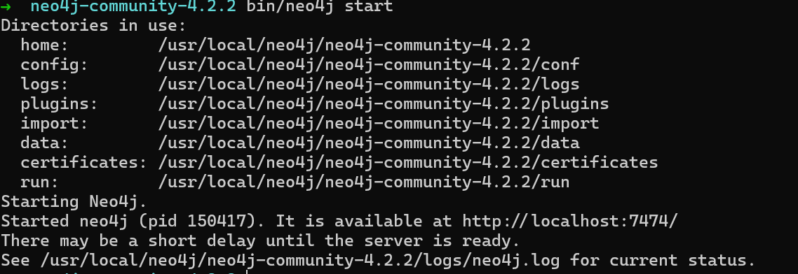

# 03-Storage 1

### Course Outline

课程大纲如下：

<figure><figcaption>
outline
</figcaption></figure>

左侧是课程讲解目录，右侧是数据库执行过程。

### Disk-Based Architecture

它假定数据库的主要存储位置是在非易失性磁盘上。&#x20;

越接近CPU，存储就越快，容量越小，也更贵。

DBMS 的组件负责管理非易失性和易失性存储之间的数据移动。

<figure><figcaption>
ARCHITECTURE
</figcaption></figure>


这门课不讨论NVMe SSD -- non-volatile memory express.


#### Access Time

图片

#### Sequential VS Random Access

对非易失性存储（磁盘）的随机访问几乎总是比顺序访问慢得多。

DBMS将希望最大化顺序访问。

→ 算法试图减少对随机页的写入次数，以便将数据存储在连续块中。

→ 同时分配多个页面称为扩展（extent）

"Allocating multiple pages at the same time is called an extent" 这句话的意思是，一次性分配多个页面被称为"extent"。

在计算机领域，一个extent是指在存储设备上一段连续的、预先分配的物理空间。当文件系统需要为一个文件或一个数据块分配一定数量的连续空间时，可以使用extent来提高效率，因为它避免了频繁的分配和管理多个单独的页面。

### System Design Goals

允许 DBMS 管理超过可用内存量的数据库。

对磁盘的读/写非常昂贵，因此必须谨慎管理，以避免大的停顿和性能下降。

磁盘上的随机访问通常比顺序访问慢得多，因此 DBMS 希望最大化顺序访问

### Disk-Oriented DBMS

哲学，经济，技术，管理，社会，生态，伦理

图片

* 数据库都在磁盘上，数据库文件中的数据被组织成页，第一页是目录页。为了对数据进行操作，DBMS需要将数据引入内存。
  * 它通过拥有**一个缓冲池来管理数据在磁盘和内存之间的交换**
  * DBMS也有一个执行查询的执行引擎。执行引擎将要求缓冲池提供一个特定的页面，而缓冲池将负责把该页面带入内存，并给执行引擎一个指向内存中该页面的指针，缓冲池管理器将确保在执行引擎对该部分内存进行操作时，该页就在那里。

### Why Not Use The OS&#x20;

* DBMS的一个高级设计目标是支持超过可用内存量的数据库。因为访问disk的代价很大，所以使用disk应该要小心。我们不希望从磁盘上访问数据时停顿太久，从而拖慢其他一切。我们希望DBMS能够处理在等待从磁盘获取数据时，能够处理其他查询。
* 这个高层次的设计目标就像虚拟内存一样，有一个大的地址空间和一个供操作系统从磁盘引入页面的地方。
* 实现这种虚拟内存的方法之一是使用mmap来映射进程地址空间中的文件内容，这使得操作系统负责在磁盘和内存之间来回移动页面，而不需要DBMS来关心
*   如果我们允许多个线程访问 mmap 文件以隐藏页面错误暂停，该怎么办？

    这对于只读访问非常有效。

    当有多个写者时，这很复杂
* 使用 mmap IO 问题
  * Problem #1: Transaction Safety：OS 可能在任何时候来刷新脏页
  * Problem #2: I/O Stalls：数据库管理系统（DBMS）不知道哪些页面（指内存中的页面）当前已经被加载到了内存中。如果DBMS需要访问某个页面，而该页面尚未在内存中，那么操作系统会发生页面错误（page fault）并将线程挂起，直到该页面被加载到内存中为止。
  * Problem #3: Error Handling：很难验证数据库中的某些页面或数据块是否完好无损，如果尝试访问损坏的页面，可能会引发SIGBUS错误，这是一种在Unix和类Unix操作系统上用于表示总线错误的信号。这种错误可能会导致应用程序崩溃或异常终止。
  * Problem #4: Performance Issues：操作系统中的不同数据结构之间存在竞争的情况。"TLB shootdowns" 是指在处理器的转换后备缓冲器（Translation Lookaside Buffer，简称TLB）中的无效项。当内核更新某些虚拟内存映射时，它可能需要使之前的TLB项无效，并在必要时通知其他处理器（如果有的话）将它们的TLB项也无效。这个过程被称为"shootdown"。在多处理器系统中，由于需要通知其他处理器，所以这个过程可能会导致一些开销和延迟。
* 可以通过使用操作系统的一些原语来解决上面的问题：
  * `madvise`: 告诉操作系统你打算何时读某些页面。
  * `mlock`: 告诉操作系统不要把内存范围换到磁盘上。
  * `msync`: 告诉操作系统将内存范围刷新到磁盘。
*   DBMS（几乎）总是想要控制事物

    并且可以比操作系统做得更好。

    → 按正确顺序将脏页刷新到磁盘。

    → 专用预取。

    → 缓冲区替换策略。

    → 线程/进程调度。

    操作系统不是你的朋友



Database Storage

Problem #1: How the DBMS represents the database in files on disk. 这节课要讲的

Problem #2: How the DBMS manages its memory and moves data back-and-forth from disk.

### File Storage

DBMS 将数据库存储为磁盘上的一个或多个文件，通常采用专有格式。

→ 操作系统对这些文件的内容一无所知。

20 世纪 80 年代早期的系统在原始存储上使用自定义文件系统。

→ 一些“企业” DBMS 仍然支持这一点。

→ 大多数较新的DBMS不这样做

这句话指的是20世纪80年代早期的计算机系统，它们使用的是自定义的文件系统，而不是像现代计算机系统一样使用标准的文件系统，比如说FAT、NTFS、HFS+等。这些早期的系统可能是由各自的厂商或团队开发，因此使用的文件系统是独特的。

此外，这些早期的计算机系统还使用原始存储设备上的自定义文件系统。在这种情况下，存储设备可能是磁带、磁盘或闪存等，而文件系统则是专门为该存储设备设计的。这种文件系统可能只适用于特定的硬件和操作系统，并且在不同系统之间可能不兼容。

#### Storage Manager

存储管理器负责维护数据库文件。数据库文件是一个由若干页（Page）组成的集合，存储了数据库中的数据和元数据信息。

一些存储管理器会执行自己的读写调度策略，以改善页的时空局部性。在这种情况下，存储管理器会按照一定的算法和规则，调度对页的读写操作，以尽可能地利用磁盘读写头的局部性，从而提高读写性能。

存储管理器还负责组织数据库文件。具体来说，它将数据库文件分成若干页，并维护一个页的列表，用于跟踪每个页的位置、状态和元数据信息。此外，存储管理器还跟踪读写到每个页的数据，以及每个页的可用空间。这些信息对于数据库系统的性能和可靠性都至关重要，因此存储管理器必须能够高效地维护和更新它们。

#### Database Pages

页面是固定大小的数据块。

→它可以包含元组、元数据、索引、日志记录……&#x20;

→大多数系统不会混合页面类型。&#x20;

一些系统要求页面是自包含的。&#x20;

每个页面都有一个唯一的标识符（页面在磁盘上的ID）。&#x20;

DBMS 使用间接层将页面id映射到物理位（从磁盘映射到内存）

在DBMS中有三种不同的“页面”概念:&#x20;

→硬件页面(通常为4KB)&#x20;

→操作系统页面(通常为4KB)&#x20;

→数据库页面(512B-16KB)

硬件页是存储设备能够保证故障安全写入的最大数据块

这句话指的是硬件页（Hardware Page），它是存储设备（比如硬盘或固态硬盘）上最大的可靠写入块。这个块的大小由存储设备的硬件特性决定，通常在几十KB到几MB之间。

这里的“可靠写入”指的是数据写入存储设备后，能够被保证不会丢失或损坏。为了实现这个保证，存储设备通常会使用一些特殊的技术，比如磁盘的写前预留（Write Precompensation）或固态硬盘的闪存控制器（Flash Controller）。这些技术可以确保数据在写入存储设备之前被正确处理和验证，从而最大程度地减少数据损坏或丢失的可能性。

因此，将数据写入硬件页是一种非常安全和可靠的写入方式，因为存储设备可以保证这个块内的所有数据都被正确地写入，并且可以在需要的时候对这个块进行数据完整性检查和恢复。这种写入方式在一些数据密集型应用程序中非常常见，比如数据库系统和文件系统，可以确保数据在写入存储设备后不会丢失或损坏，从而保证了数据的可靠性和一致性。
