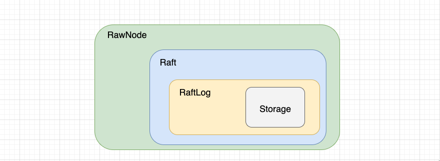
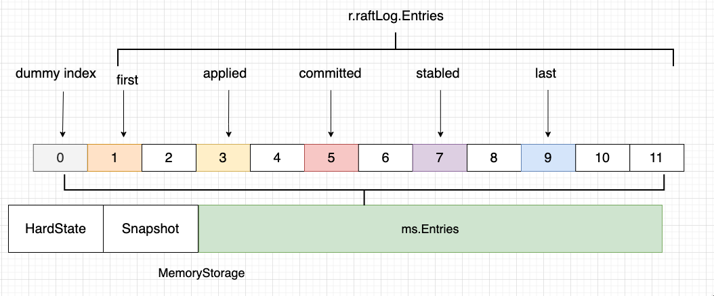

# Project2-RaftKV-A

## 项目要求

项目文档：[https://github.com/talent-plan/tinykv/blob/course/doc/project2-RaftKV.md](https://github.com/talent-plan/tinykv/blob/course/doc/project2-RaftKV.md)

该项目要求我们实现一个基于 raft 的高可用 kv 服务器。主要有三个部分：

1. 实现基本的 Raft 算法
2. 在 Raft 之上建立一个容错的 KV 服务器
3. 增加对 raftlog GC 和快照的支持

第一部分就是 2A 所要完成的事情。2A 所要完成的又有三个方面。

1. 领导选举
2. 日志复制
3. RawNode接口

前两方面绝大多数都来自于 [Raft论文](https://raft.github.io/raft.pdf) 原文。关于 Raft 论文方面的讲解资料很多，本文档不再赘述。

这是来自于官方的一些提示：


* 在 <mark style="background-color:blue;">raft.Raft</mark>、<mark style="background-color:blue;">raft.RaftLog</mark>、<mark style="background-color:blue;">raft.RawNode</mark> 和 <mark style="background-color:blue;">eraftpb.proto</mark> 上添加任何你需要的状态。
* 测试文件假设，第一次启动的 Raft 应该有 term 0。
* 测试文件假设，新当选的领导应该在其任期内附加一个 noop 日志项。
* 测试文件假设，一旦领导者推进其 commit index，它将通过 <mark style="background-color:blue;">MessageType\_MsgAppend</mark> 消息广播提交索引。
* 测试文件假设，没有为本地消息：<mark style="background-color:blue;">MessageType\_MsgHup</mark>、<mark style="background-color:blue;">MessageType\_MsgBeat</mark> 和 <mark style="background-color:blue;">MessageType\_MsgPropose</mark> 设置 term。
* 在领导者和非领导者之间，追加的日志项是相当不同的，有不同的来源、检查和处理，要注意这一点。
* 不要忘了选举超时在 peers 之间应该是不同的。
* <mark style="background-color:blue;">rawnode.go</mark> 中的一些封装函数可以用 <mark style="background-color:blue;">raft.Step(local message)</mark> 实现。
* 当启动一个新的 raft 时，从 <mark style="background-color:blue;">Storage</mark> 中获取最后的稳定状态来初始化 <mark style="background-color:blue;">raft.Raft</mark> 和 <mark style="background-color:blue;">raft.RaftLog</mark>。


## 如何实现

本次实验有三个部分，但分开讲解可能会损失一定的关联性，所以还是从整体结构上来说明这个实验。项目的结构如下：

<figure><figcaption><p>项目架构</p></figcaption></figure>

### 日志模块-RaftLog

```go
type RaftLog struct {
   storage Storage
   committed uint64
   applied uint64
   stabled uint64
   entries []pb.Entry
   pendingSnapshot *pb.Snapshot
   firstIndex uint64
}
```

1. RaftLog 中的 committed、applied、entries 等在论文中都有所出现，但 storage、stabled 是第一次见。
2. Storage 为一个抽象类，这里的具体实现为 MemoryStorage，作为 RaftLog 持久化用，在 Raft 重启时，从 Storage 中恢复相应的状态，结构体如下所示。

```go
type MemoryStorage struct {
   sync.Mutex

   hardState pb.HardState
   snapshot  pb.Snapshot
  
   ents []pb.Entry
}
```

3. 各个子模块存储信息如下：

> HardState
>
> * Term: Raft.Term
> * Vote: Raft.Vote
> * Commit: Raft.RaftLog.committed
>
> Snapshot
>
> * Data: Snapshot中所有的Entry
> * MetaData
>   * Index: Snapshot最后一个Entry的Index
>   * Term: Snapshot最后一个Entry的Term
>   * ConfState
>     * Nodes: Peers
>
> Stabled Entries: ms.ents

4. 既然 MemoryStorage 存有一部分 RaftLog 的日志，那么它们之间的就会有一定的位置关系。见下图：

<figure><figcaption><p>memory storage 与 raftlog 关系图</p></figcaption></figure>


当日志刚刚生成时，在 NewMemoryStorage 时有这样一个注释，**When starting from scratch populate the list with a dummy entry at term zero.**


这也就解释了为什么在下面的 firstIndex 方法中会有 +1。

```go
func (ms *MemoryStorage) firstIndex() uint64 {
   return ms.ents[0].Index + 1
}
```

如果有使用 ApplySnapshot 的话那么 ms.ents 的第一位就是 snapshot 的 index，那么第一个index就应该在此基础上加一，如果没有使用 ApplySnapshot，那么在初始化的时候就放入了一个dummy entry，默认的index为 0，+1 后为 1 刚好是 index 的起始数字。

5. 在刚开始的 newLog 的时候，整体的状态应该如下，这里我加了一个 dummy Index 字段，因为后面要经常和它打交道。

```go
func newLog(storage Storage) *RaftLog {
	// Your Code Here (2A).
	lo, _ := storage.FirstIndex()
	hi, _ := storage.LastIndex()
	entries, err := storage.Entries(lo, hi+1)
	if err != nil {
		panic(err)
	}
	hardState, _, _ := storage.InitialState()
	return &RaftLog{storage: storage, committed: hardState.Commit, applied: lo - 1, stabled: hi, entries: entries, dummyIndex: lo}
}
```

根据一位大佬在 [白皮书](https://github.com/Smith-Cruise/TinyKV-White-Paper/blob/main/Project2-RaftKV.md) 中所说的，按道理 stabled 之前的数据已经被持久化了，没必要再载入内存。 这么做是为了实现简单，用内存换效率。像 Etcd 中会直通过 stable 和 unstable 结构来进行区分，这里为了简单，就混一起了。

6. todo：感觉有需要快照的一部分。

### 一致性模块-Raft

1. 投票拒绝人数超过一半直接变为follower
2. 一个节点发起选举，直接变为leader
3. 一个节点进行提交时，直接把该日志追加即可，无需广播
4. 选举时间需要随机化，测试文件要求最好是 \[electionTimeout，2\*electionTimeout)
5. 在 handleHeartbeat 的时候 把 lastIndex 也发送过去，便于在 handleheartbeatResponse 的时候比较是否日志追加完全，如果不完全，继续发送日志。
6. 当 leader 更新了 commitIndex 后，需要再次广播日志，让其他的节点来更新已经提交的日志
7. 在 leader 给其他节点发送日志时，应该如下操作：

```go
for _, entry := range toSendEntries {
   // don't use: entries = append(entries, &newEntry), or it will always send the same entries as the last one
   var newEntry = &pb.Entry{}
   *newEntry = entry
   entries = append(entries, newEntry)
}
```

### 接口模块-RawNode

RawNode 是为上层应用提供的接口，它包含了 raft.Raft 并且提供了一些函数如 Rawnode.Tick() 和 Rawnode.Step() ，并且还提供了 RawNode.Proposal() 来让上层应用附加新的raft日志。

在外面调用RawNode的整个流程大概就是这样的：

```go
if !rawnode.HasReady(){
    return 
}
ready := rawnode.Ready()
// upper system use ready 
rawnode.Advance()
```

// todo 可能快照有关，等pro2 和 pro3 lab全做完再更新代码层级的东西，现在就记录一下坑点。

<details>

<summary>Noop</summary>

### 当一个节点成功当选 Leader 的时候，为什么需要发送一个 Noop？

在raft论文中有这样一种情况：


* a) S1 是 Term2 的 Leader，将 LogEntry 部分复制到 S1 和 S2 的 2 号位置，然后 Crash
* b) S5 被 S3、S4 和 S5 选为Term3 的 Leader，并只写入一条 LogEntry 到本地，然后Crash
* c) S1 被 S1、S2 和 S3 选为 Term4 的 Leader，并将 2 号位置的 LogEntry 修复到 S3，达到多数；并在本地写入一条 Log Entry，然后 Crash。

<mark style="color:red;">这个时候 2 号位置的 Log Entry 虽然已经被复制到多数节点上，但是并不是 Committed 的。在论文 3.6.2中写到，不允许 leader 提交之前任期的日志。现在的 S1 的任期是 4，不能提交 2（why？）</mark>

（d）和 （e）分为两种情况来看

<mark style="color:green;">假如可以提交之前任期的日志，那么</mark>

* d) S5 被 S3、S4 和 S5 选为 Term5 的 Leader，它就可以将本地 2 号位置 Term3 写入的日志复制到其他节点，覆盖 S1、S2、S3 上 Term2 写入的数据。<mark style="color:green;">这就导致了已经提交了的日志就被覆盖了</mark>，这是不允许的。

<mark style="color:green;">那么在 Raft 论文中的做法是</mark>

* e) S1 被 S1、S2 和 S3 选为 Term5 的 Leader，将 3 号位置 Term4 写入的日志复制到 S2、S3，使得2 号位置 Term2 写入的数据变为 Committed。即 Leader 当选之后，不要首先提交本地已有的日志2，而是首先提交一条新日志 4，如果这条新日志被提交成功，那么按照 Raft 日志的匹配规则，它前面的日志也随之被提交了。

<mark style="color:green;">这样一个新的问题出现了，S1 重新当选之后，客户端写入没有这条新的日志 4，那么前面的日志 2 就会无法提交。</mark>

于是就有了 Noop，它没有实际的数据，但有索引号和日志，用来驱动 Committed Index。

但 Noop 出现的根源问题是为了解决 一致性协议中的“幽灵复现” 问题，也就是说为了解决“幽灵复现问题”出现了NO-OP这一个操作，可以来看大佬的 [文章](https://z.itpub.net/article/detail/FF839918503031AB94984EA4AE1346CD)。

</details>


<mark style="color:red;"></mark>
