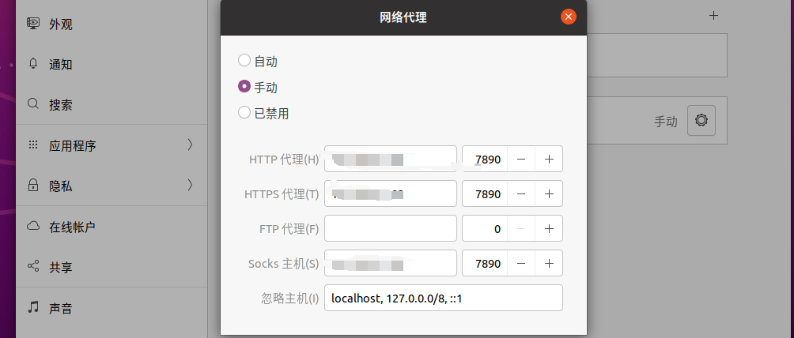

# windows 下安装ubuntu

* 安装界面太小，按 alt+f7 加鼠标滚轮调动
* 换源
  * 利用百度搜索 [https://mirror.tuna.tsinghua.edu.cn/help/ubuntu](https://mirror.tuna.tsinghua.edu.cn/help/ubuntu)
  * sudo apt-get update（更新）
  * sudo apt-get upgrade（升级）
* 虚拟机屏幕无法适应，其实就是安装 vmware tools，可以手动，可以自动，自动如下（要先换源，不然那个维护软件包啥玩意的不让安装）：

```bash
sudo apt install open-vm-tools-desktop -y
sudo reboot
```

* 虚拟机改代理，前面的数字为主机 ipconfig 下的 ip

<figure><figcaption><p>修改虚拟机代理</p></figcaption></figure>

* 虚拟机终端代理命令

```bash
git config --global https.proxy https://ip:7890
git config --global http.proxy http://ip:7890
```

* 远程连接时，虚拟机需要 ssh 服务

```bash
sudo apt-get install openssh-server
sudo /etc/init.d/ssh start
```
